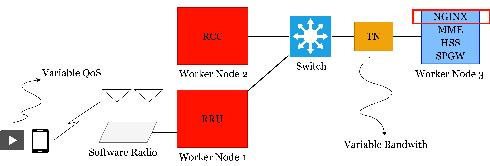
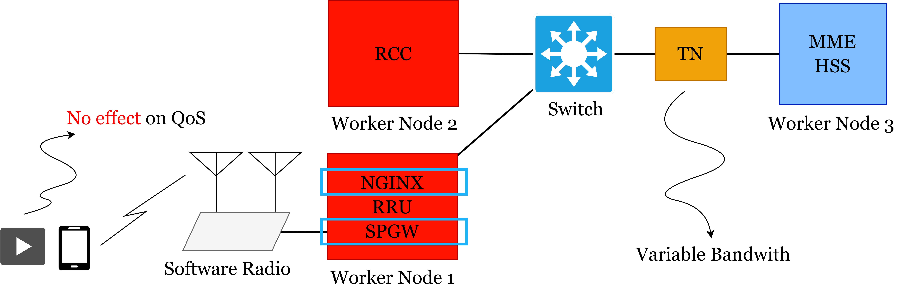

# VNF Placement
## Cloud Computing (CC)
### Topology

### Implement
### Results

| Bandwidth (mb/s) | Delay (ms) | Bit Rate (mb/s) | Ping (ms) |
| --- | --- | --- | --- |
| 10 | 0 | 1.09 | - |
| 5 | 50 | 573 | 120 |

## Mobile Edge Computing (MEC)
### Topology

### Implement
### Results

|   Bandwidth (mb/s) | Delay (ms) | Bit Rate (mb/s) | Ping (ms) |
| --- | --- | --- | --- |
|                  10|           0|             1.09|          -|
|                   5|          50|             1.08|        340|
